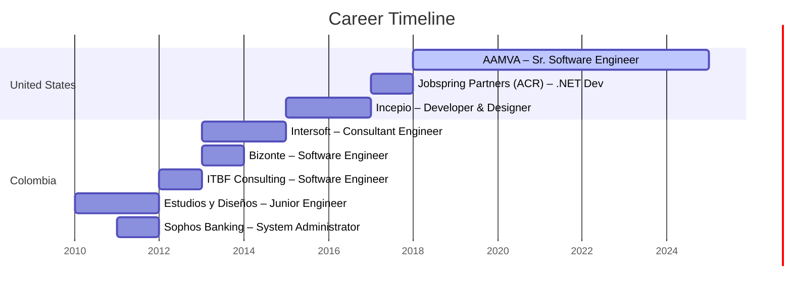
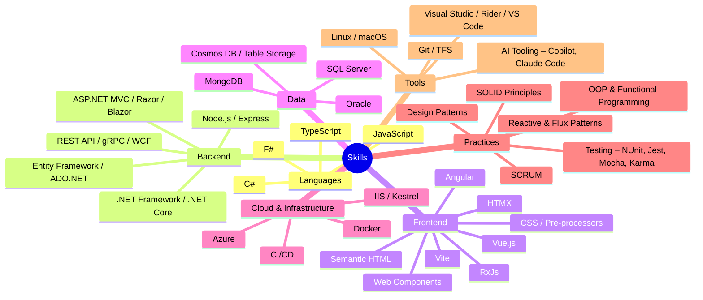

# Alex Flechas

**Software Engineer** | [aflechas.me](https://www.aflechas.me/) | [LinkedIn](https://www.linkedin.com/in/alexflechas/)

## Summary

Bilingual (Spanish/English) Full Stack Software Engineer with 15+ years of experience designing, developing, and maintaining web and desktop applications across multiple platforms — particularly .NET and Node.js. Experienced in front-end development with Angular, Vue, and modern web standards. Committed to continuous learning and delivering value through software.

## Career Timeline



## Skills



## Experience

### AAMVA — Ballston, VA, US 🇺🇸

```csharp
var company = "American Association of Motor Vehicle Administrators";
var role = "Sr. Software Engineer";
var period = (Start: 2018, End: "Present");
var frontend = "Angular";
var backend = ".NET Core";
var task = "Development of applications to provide services to participant jurisdictions (states)";

Console.WriteLine($"{role} at {company} ({period.Start}–{period.End}): {task} using {frontend} and {backend}");
```

### Jobspring Partners / ACR — Reston, VA, US 🇺🇸

```csharp
var company = "American College of Radiology";
var role = ".NET Developer";
var year = 2017;
var stack = new[] { ".NET Framework", "ASP.NET", "SQL Server", "jQuery", "Vue.js" };
var contributions = new[] { "Accreditation Project development", "CI/CD process implementation", "Testing framework setup", "Front-end automation tooling" };

Console.WriteLine($"{role} at {company} ({year}): {string.Join(", ", contributions)} with [{string.Join(", ", stack)}]");
```

### Incepio — Washington D.C. Metro Area, US 🇺🇸

```csharp
var company = "Incepio";
var roles = new[] { "Developer", "Designer" };
var period = (Start: 2015, End: 2017);
var analyticsStack = new[] { ".NET 4.5", "SQL Server 2014", "AngularJS" };
var webStack = "MEAN";
var type = "Professional Part-Time Volunteer Practice";

Console.WriteLine($"{string.Join(" & ", roles)} at {company} ({period.Start}–{period.End}): Analytics app with [{string.Join(", ", analyticsStack)}] + {webStack} stack apps — {type}");
```

### Intersoft — Bogota, Colombia 🇨🇴

```csharp
var company = "Intersoft";
var client = "eltiempo.com";
var role = "Consultant Engineer";
var period = (Start: 2013, End: 2014);
var stack = new[] { ".NET 3.5", "SQL Server" };
var highlight = "highly transactional application";

Console.WriteLine($"{role} at {company} ({period.Start}–{period.End}): {highlight} for {client} using [{string.Join(", ", stack)}]");
```

### Bizonte / Nuevagenda.com — Bogota, Colombia 🇨🇴

```csharp
var company = "Bizonte / Nuevagenda.com";
var role = "Software Engineer";
var year = 2013;
var stack = new[] { "MVC 4", "SQL Server" };
var task = "Web application development";

Console.WriteLine($"{role} at {company} ({year}): {task} using [{string.Join(", ", stack)}]");
```

### ITBF Consulting — Bogota, Colombia 🇨🇴

```csharp
var company = "ITBF Consulting";
var client = "Legis Colombia";
var role = "Software Engineer";
var year = 2012;
var stack = new[] { ".NET 4 Windows Forms", "Oracle" };
var task = "Development and support of a desktop application";

Console.WriteLine($"{role} at {company} ({year}): {task} for {client} using [{string.Join(", ", stack)}]");
```

### Estudios y Diseños Ingenieria — Bogota, Colombia 🇨🇴

```csharp
var company = "Estudios y Diseños Ingeniería";
var roles = new[] { "Developer", "Infrastructure Manager" };
var period = (Start: 2010, End: 2012);
var stack = new[] { "Joomla", "WordPress", ".NET", "SQL Server", "MySQL" };
var task = "Development and support of internal and customer applications";

Console.WriteLine($"{string.Join(" & ", roles)} at {company} ({period.Start}–{period.End}): {task} using [{string.Join(", ", stack)}]");
```

### Sophos Banking Solutions — Bogota, Colombia 🇨🇴

```csharp
var company = "Sophos Banking Solutions";
var role = "System Administrator";
var year = 2011;
var assets = new[] { "network", "servers", "devices" };
var task = "Support of physical infrastructure";

Console.WriteLine($"{role} at {company} ({year}): {task} — [{string.Join(", ", assets)}]");
```

## Education

| Degree | Institution | Period |
|--------|-------------|--------|
| **M.S. Software Engineering Management** | Strayer University, Arlington, VA | 2015 – 2016 |
| **B.A. Software Engineering** *(Ingeniero de Sistemas)* | Universidad Libre, Bogota, Colombia | 2004 – 2009 |

## Certifications

- **Azure Fundamentals** — Microsoft
- [Pluralsight Profile](https://app.pluralsight.com/profile/alex-flechas)
